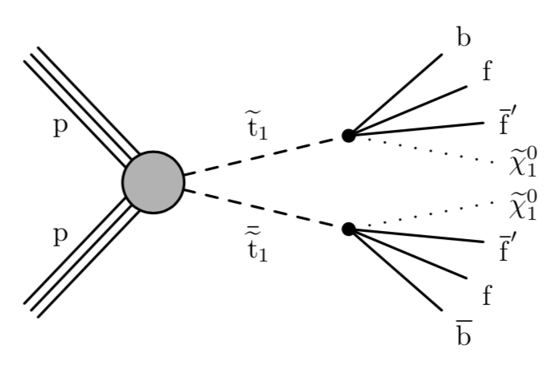
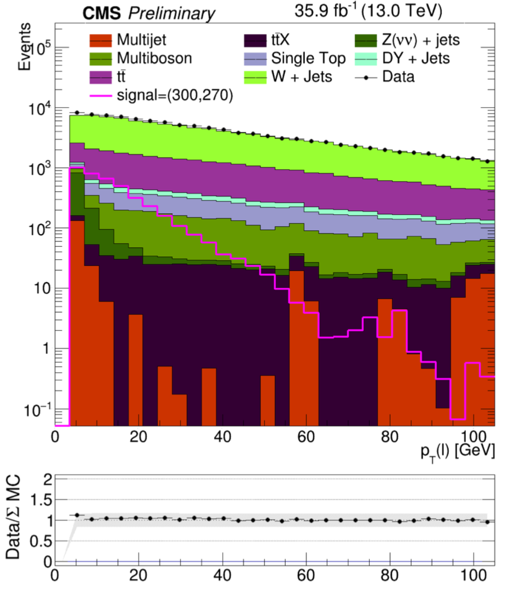

# LIP Summer Internship 2019: Stop 4-body decay with NN approach

In the next 4 weeks you are going experience a little bit of what an experimental particle physicist does. We are going to focus on search for stop pair production where each stop decays in four bodies.



We'll be looking in the compressed scenario where: Δm = m(stop)-m(neutralino) < 80 GeV using 2016 samples. Since we don't know the mass of the stop nor the mass of the neutralino our signal will be different Δm's (from 10 to 80 GeV) composed of different signal points with the same Δm. Our background is all the standard model processes that have the same signature as the signal: 1 lepton, jets and missing transverse energy (MET). To separate signal from background you're going to develop a NN.

You'll find everything you need in 2016 publication [CMS-SUS-17-005](https://arxiv.org/pdf/1805.05784.pdf)!

By the end of this internship you'll understand a little bit more of experimental particle physics from both a theoretical and a practical point of view. I hope this guide will be useful to you and that you develop your coding skills in python, root, shell scripting and a little bit of C++.

## Setup

This are the steps you need to do before your work as a summer student starts. You should only do it once.

1. Get access with the IT team to lip's ncg machines
1. From your computer, connect to **cassini** via ssh
```sh
ssh -CY <username>@cassini.ncg.ingrid.pt
```
1. Create a symlink to your **lstore** space
```sh
ln -s /lstore/cms/<username> LSTORE
```
1. Clone with SSH this repository to you working area
```sh
cd LSTORE
git clone git@github.com:diogodebastos/StopNN.git
cd StopNN
git checkout ev19
```

**ev19** is the branch your are going to use for this summer project.

If you've never worked with GitHub and don't know how to clone a repository [here](https://help.github.com/en/articles/cloning-a-repository) is a helpful guide! You'll also need to generate a new ssh key to do so, follow [this]([here](https://help.github.com/en/articles/generating-a-new-ssh-key-and-adding-it-to-the-ssh-agent).

## Step 0 - Preparing your Data

The first step is to prepare your data for the neural network. You are going to use Monte Carlo (MC) simulated datasets for both signal and background. This MC samples should truthfully represent detector Data.



We can see that the Data/MC agreement is pretty good within 20%. This means we can trust our simulated datasets. The next step is to split our datasets into **train** and **test**. We want to train our NN in one dataset and them test in another to have an unbiased evaluation of a final model. Typically, in Machine Learning we also use a **validation** dataset different from the others to tune the model hyperparameters. In  this exercises the test and validation  datasets are  the same for the sake of simplicity. Since the main focus of your internship is to develop a NN, this step is already done. The samples are located here: `/home/t3cms/dbastos/LSTORE/Stop4Body/` in `nTuples16_v2017-10-19*` directories.

#### Exercise 1 - Inspect your datasets

In this exercise you are going to open the samples you're going to use, understand them and inspect the features of your NN. This means you'll use [root](https://root.cern.ch/) - a data analysis software born at CERN. [Click here for a very useful root guide](https://root.cern.ch/root/htmldoc/guides/primer/ROOTPrimer.html).

1. Load root in your session at **cassini**
```sh
module load root
```
1. Go to the following directory: `/home/t3cms/dbastos/LSTORE/Stop4Body/nTuples16_v2017-10-19_test`
```sh
cd /home/t3cms/dbastos/LSTORE/Stop4Body/nTuples16_v2017-10-19_test
```
1. Open the signal sample m(stop)=550 and m(neutralino)=520
```sh
root -l T2DegStop_550_520.root
```
1. Inspect the content of *bdttree*
```sh
new TBrowser
```
1. Draw the distribution of the leptons momentum - **LepPt**
```sh
TH1D* t = new TH1D("t", "lepPT", 200,0,200)
bdttree->Draw("LepPt>>t")
```
1. Repeat these steps for the following variables: XS, Jet1Pt, Met, mt, LepEta, LepChg, HT, NbLoose, Njet, JetHBpt, DrJetHBLep and JetHBCSV

1. Repeat the same steps for other signal samples, for **T2DegStop_deltaM30.root** and for background samples: WJets, TTbar, ZInv

Tip: For the last 2 steps, writing a script that does this work for you and then plots the variables might help you! You can use these [scripts as inspiration](https://github.com/diogodebastos/Stop4Body/tree/master/Macros/pMacros). This type of scripts that runs on root are called **Macros**:
[working with macros](https://root.cern.ch/working-macros).

## Step 1 - Training a Neural Network

Reading:

Now that your datasets are ready and you are familiar with the main variables it's time to build your machine learning model. To do this, you should use the `trainNN.py` script.

#### Exercise 2 - Build your first NN model for classification

For this exercise, I eagerly advise you to have a look into [this tutorial](https://machinelearningmastery.com/tutorial-first-neural-network-python-keras/).

1. Build a NN with:
 - Input layer: 12 neurons
 - 1 Hidden layer: 14 neurons
 - Output layer: 1 neuron
 - Epochs: 100
 - Batch size: 3000
 - Learning rate: 0.001
 - Use **relu** activation function for input and hidden layers and **sigmoid** for the output layer
 - Kernel initializer: **he_normal** for input and hidden layers and **glorot_normal** for the output layer
2. Plot accuracy and loss evolution over epochs for both training and validation datasets. What can you tell about your model?
3. Port your model to the `commonFunctions.py` script as a function, call it `ev19Classifier` and use it in `trainNN.py`. Something like:
```sh
model = ev19Classifier(...)
```

#### Exercise 3 - Improve your NN

1. Improve your model. Here you can play with every parameter of the first step of the precious exercise. You should do some reading to understand how and what you can do to **optimize** your model.
2. Build **3** more models (as functions in `commonFunctions.py`)
3. What was the best model you could come up with?

Tip: to improve the speed of your training you should use lip's batch system and submit your training as a job. To do this, you can use/edit the `trainNN.sh` script. To submit it, do the following:
```sh
qsub trainNN.sh
```

----

- callback
- classifier in commonFunctions
- keras
- tensorflow


------------
